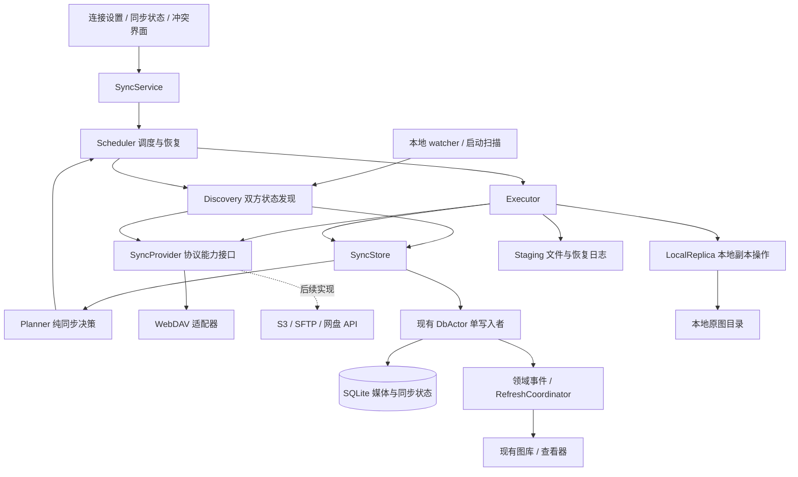
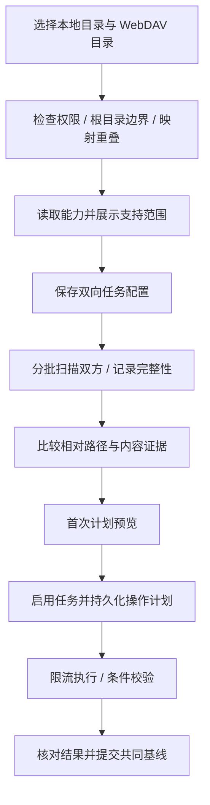
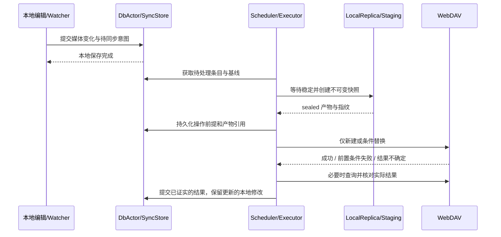
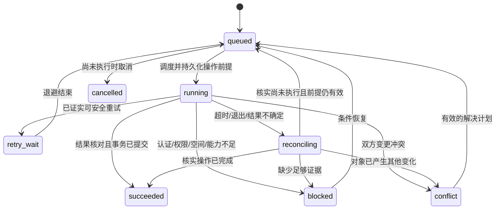

# 双向同步：关键架构、流程与约束

日期：2026-09-19。状态：实现前设计，尚未开发。

本文细化 [WebDAV 接入方案](../webdav-sync-design.md)，定义预计实现的行为契约、模块责任、状态和验收标准。流程图、状态名和数据字段用于设计评审，不是已存在的 API。现有功能仍以 `docs/modules/` 为准。

## 1. 已确定的交付边界

首版提供本地目录与 WebDAV 目录之间的双向内容同步：双方新增与修改、冲突处理、暂停、重试、重启恢复。WebDAV 是首个适配器，同步决策和恢复机制不依赖 WebDAV。

| 项目 | 首版决策 |
|---|---|
| 同步对象 | 支持的照片、视频、保存后的编辑结果，以及文件的相对目录结构 |
| 查看方式 | 继续读取本地文件；完整下载并发布后才进入图库 |
| 编辑方式 | 本地保存成功后异步同步；网络错误不能撤销本地保存 |
| 删除传播 | 默认关闭；首版识别缺失并保留状态，自动传播删除后续单独开放 |
| 重命名 | 首版识别应用内明确的重命名，保留关联；远端旧名称的自动清理受删除/移动能力和策略限制，不能承诺默认两端目录完全镜像 |
| 应用元数据 | 收藏、封面、排序、编辑历史不在首版同步范围 |
| 生命周期 | 同步随应用运行，退出后停止；再次启动先恢复再调度 |
| 可扩展性 | Rust 模块与 trait；暂不引入动态插件或后台守护进程 |

首版不是全目录镜像。删除传播关闭时，两端内容可能因明确删除或重命名而不同；界面必须展示这种差异，不能显示“完全一致”。

## 2. 关键架构

图中箭头表示调用或数据流；Planner 的输入是 Store 提供的不可变快照，不持有数据库连接。

| 模块 | 拥有的责任 | 不应承担的责任 |
|---|---|---|
| SyncService | 任务配置、控制入口、UI 状态投影 | 直接发送 DAV 请求或执行文件覆盖 |
| Discovery | 双方枚举、内容版本观察、扫描完整性 | 根据一次文件缺失直接删除另一侧 |
| Planner | 基于基线计算无操作、上传、下载、冲突、待处理 | 网络、文件和 SQL 副作用 |
| Scheduler | 队列、并发限制、对象串行、任务恢复与退避 | 决定冲突哪一侧获胜 |
| Executor | 检查操作前提、执行计划、核对结果 | 绕过 Planner 和版本前提强行覆盖 |
| LocalReplica | 稳定读取、上传快照、下载发布、与本地变更协调 | GTK 展示、协议认证 |
| SyncProvider | 枚举、读写、条件操作及服务能力 | 修改媒体库、决定同步方向 |
| SyncStore | 状态查询、事务命令、代次校验 | 第二个数据库写入线程 |
| Staging | 不可变上传产物、下载产物、旧版本与恢复日志 | 普通可清理缩略图缓存 |
| CredentialStore | 平台凭据保存与读取 | 让密码进入配置、任务表或日志 |

所有同步 SQLite 写入继续经过现有 DbActor。网络、哈希、大文件复制和 XML 解析在工作线程执行，不能占用 GTK 主线程或数据库事务。DbActor 不等待网络、文件锁或 UI 回调。

复用现有 Tokio runtime；同步逻辑放在 `src/core/sync/`，凭据实现放在 `src/platform/`，GTK 放在 `src/ui/`。以后增加 provider 原则上不修改 Planner、同步表语义和冲突规则，服务专有登录可扩展配置界面。

## 3. 数据模型与一致性边界

### 3.1 身份与版本

| 概念 | 含义与约束 |
|---|---|
| ConnectionId | 服务端点和账号配置身份；凭据更新不更换同步对象身份 |
| JobId | 一组本地根、远端根、范围和策略的映射；首版拒绝应用内重叠映射 |
| EntryId | 持久同步对象身份，独立于可重建的 MediaId |
| RelativePath / ObjectKey | 双方定位信息；路径不是内容身份，ObjectKey 不是 OS PathBuf |
| LocalObservation | 存在性、文件身份、长度、mtime 纳秒值、内容指纹、观察代次 |
| RemoteObservation | 存在性、对象位置、版本验证器及其强度、大小、扫描代次 |
| Baseline | 上次双方已确认对应的内容指纹、各自版本和位置；不是最近一次扫描结果 |
| OperationId | 一次持久操作及其产物的身份，跨重试保持，用于去重和恢复 |

观察状态有 `present / absent / unknown` 三种。超时、未扫描、权限错误都是 unknown，不能折叠为 absent。mtime 与长度用于筛选候选变化，不能单独证明内容相同；ETag 不作为内容哈希或全局文件 ID。

本地 MediaId 继续服务图库查询；同步条目的媒体关联允许为空、媒体行删除时置空，不级联删除同步条目。远端文件未下载时只进入同步清单，不为它创建带伪路径的 MediaItem。

### 3.2 持久实体

| 实体 | 最小持久信息 |
|---|---|
| sync_connections | provider 类型、端点、凭据引用、能力和探测结果 |
| sync_jobs | 双方根目录、范围、策略、配置代次、暂停状态 |
| sync_entries | 双方观察、共同基线、独立对象 ID、可空 MediaId、缺失/删除状态 |
| sync_tasks | OperationId、EntryId、操作类型、预期版本、配置/条目代次、产物引用、状态、重试时间 |
| sync_conflicts | 基线、冲突双方版本、原因、用户选择及选择时的版本 |
| sync_scan_runs | 扫描代次、配置代次、已完成目录范围、错误/取消状态、可选远端游标 |
| sync_artifacts | 产物归属、类型、长度/哈希、sealed 标记、引用与回收状态 |

这是逻辑模型，不要求每个实体都对应独立表；扫描完整性、产物归属和恢复阶段必须持久，不能只存在内存。唯一性至少包括任务内有效路径、OperationId；索引覆盖待执行任务、重试时间和任务内条目查询。

重启和索引重建不得更换 EntryId 或清除 Baseline。更换远端根、账号所指图库或过滤规则需要新的配置代次、暂停旧计划并重新对账，不能沿用旧计划解释新的目录。

### 3.3 提交边界

1. **本地意图事务**：应用内保存/重命名完成后，媒体变化与同步待处理意图在同一 DbActor 事务中提交。此时不要求联网，也不要求同步产物已生成。
2. **操作准备事务**：记录 OperationId、操作前提、恢复阶段和已封存产物的引用，再允许发生远端写入或本地文件替换。
3. **结果事务**：核对实际操作结果后，更新相应基线、任务结果以及适用的媒体状态。事件在提交后发布。

文件系统、WebDAV 与 SQLite 没有跨系统原子事务。文件操作前写持久恢复日志；失败后通过证据对账或保留版本恢复，不能依赖“失败时总能回滚”。

上传 v2 期间本地又保存了 v3：远端 v2 成功后，记录 v2 的传输结果和共同基线，但保留本地 v3 的 dirty 状态及后续任务。陈旧结果不得把新修改标记为已同步。

## 4. Provider 能力契约

| 能力 | WebDAV 实现方向 | 缺失时行为 |
|---|---|---|
| 枚举 / 查询 | PROPFIND Depth 1，逐目录遍历 | 无法读取则暂停；不把失败当空目录 |
| 父目录准备 | MKCOL，处理已存在和权限错误 | 当前对象失败，不跳过必要目录后继续写 |
| 读取 | 流式 GET；有强验证器时条件读取 | 没有稳定版本证据时标为弱保证，不能假装快照一致 |
| 仅新建 | 条件 PUT，If-None-Match: * | 不具备可靠无覆盖创建时禁止自动写入 |
| 条件替换 | 强 ETag 与 If-Match | 无可靠比较并替换能力时禁止自动覆盖，提示端点不满足完整双向同步要求 |
| 范围读取 | Range 与 If-Range，核对 206 和 Content-Range | 从头重传；不能拼接不同版本 |
| 条件移动 | 服务验证后的 MOVE 条件语义 | 不把复制后删除冒充原子重命名 |
| 增量枚举 | 可选 sync-token / REPORT | 完整遍历；游标失效重新建立扫描 |
| 回收 / 版本保留 | 服务专有扩展 | 首版不传播删除；后续定义可恢复策略后才能开放 |

可靠条件写入必须验证服务器行为，OPTIONS 声明不足以作为证据。无服务器幂等键时，OperationId 只提供本地恢复身份，不能宣称远端 exactly-once。

DELETE、MOVE 与 PUT 的条件能力分别声明，不能从支持某一种推断全部支持。临时上传再 MOVE 只有在目标前置条件和替换行为通过验证时才启用。

协议数据不可信：解析 namespace 和每个 207 子状态；限制 XML/响应资源使用；校验 href 来源、根目录边界、编码；禁用外部实体解析。HTTPS 校验默认开启，跨来源重定向不得携带凭据。

## 5. 关键流程

### F1：建立任务与首次对账

首次计划预览展示上传、下载、冲突和预计字节量；未知字节数明确标注。读取探测可直接进行；写能力实测在用户启用写同步时，使用任务专属随机探测对象并只清理自己的对象，不修改已有照片。

没有基线时：仅本地存在则计划仅新建上传，仅远端存在则计划本地无覆盖下载；两端同路径时核对内容，相同建立基线，不同进入首次关联冲突。不能用设备时钟决定覆盖方向。

枚举逐目录流式处理并分批入库。同一任务的扫描 single-flight，新增触发合并为下一轮，旧扫描不得覆盖新配置或推进其游标。部分成功可以登记已发现对象，但只有相应目录范围完整结束后才能判断其中的缺失；超限或取消的扫描保持不完整。普通 WebDAV 枚举不是全局原子快照，执行每个计划前仍检查当前对象版本。

### F2：本地新增或修改上传

上传快照必须与操作记录的内容指纹一致；硬链接无法保证源文件原地修改时的不可变性，不能作为通用快照。使用复制或已验证的写时复制，封存前核对源文件代次和指纹，变化则重做。外部写入一直不稳定时延后任务。

应用内编辑只在保存后产生同步意图，拖动编辑预览不产生任务。外部文件修改通过 watcher 稳定检测和定期/启动扫描补偿；不能只依赖易丢失的内存事件。

412 表示操作前提失效：重新读取双方后再规划。如果只有远端变化，可能变为下载；双方变化才形成内容冲突。401/403 等错误暂停相应范围；响应丢失进入 F5，不直接重传。

### F3：远端新增或修改下载

1. Discovery 记录远端版本；Planner 确认本地相对基线未修改，生成携带双方预期版本的下载任务。
2. Executor 下载到受管理临时文件，验证响应、长度、版本与内容指纹；未完成文件不得出现在图库。
3. 在目标文件系统准备发布产物，持久化恢复日志。跨文件系统必须先复制并同步目标侧临时文件，不能假设 rename 跨盘原子。
4. 获取短时本地变更协调锁，再次确认目标不存在（新增）或仍等于计划的本地版本（替换）。长时间网络传输不持有该锁。
5. 新增使用无覆盖发布；替换保留可恢复的旧版本，完成原子发布并同步相关文件/目录。检测到竞争时保留下载产物并重新规划。
6. 提取元数据并提交媒体变化、内容版本、同步结果；发送领域事件，刷新可见媒体及派生相册。
7. 释放恢复产物仅在数据库结果已持久、没有任务/冲突引用且保留策略允许后发生。

本地发布锁与编辑保存、删除、移动共用。它不能约束外部编辑程序；外部并发存在时采用最终复查和旧版本保留，不承诺完整文件系统事务隔离。发现不确定竞争时不继续覆盖，进入核对或冲突。

如果文件已发布而数据库提交失败，保留操作证据并恢复对账，不能盲目用旧备份覆盖此后用户新编辑的文件。

### F4：冲突与用户处理

| 基线与双方观察 | 决策 |
|---|---|
| 任一侧 unknown | 等待或补充扫描，无覆盖和删除 |
| 无基线，一侧存在 | 仅新建复制到另一侧 |
| 无基线，双方存在且内容不同 | 首次关联冲突 |
| 双方均等于基线 | 无操作 |
| 仅本地变化，远端未变 | 条件上传 |
| 仅远端变化，本地未变 | 下载并检查本地发布前提 |
| 双方变化但内容相同 | 更新基线，无需再次传输 |
| 双方变化且内容不同 | 保留双方，内容冲突 |
| 有基线，一侧消失，删除传播关闭 | 标记待处理差异；不删除另一侧，也不自动补回 |
| 一侧消失，另一侧修改 | 删除与修改冲突 |
| 双方均确认消失 | 保留删除历史，不创建传输任务 |

冲突记录绑定双方具体版本。用户选择“本地版本”或“远端版本”后，必须重新核对这些版本；任何一侧变化都使旧选择失效，重新展示冲突。选择获胜版本也不能跳过版本条件写入。

“保留双方”先为两份内容创建持久产物，再在双方以确定的冲突副本名称无覆盖保存。名称包含持久 OperationId，重试复用相同名称；遇到第三方占用则核对哈希或重新分配，不能覆盖。两份内容都得到保护前不替换原路径；冲突只在相关操作完成后标记已解决。

### F5：暂停、取消、断网与重启恢复

任务暂停是 Job 状态：不再领取新操作，保留队列。正在执行的网络请求可取消，但已发出的写请求可能已经成功；中断后进入 reconciling。取消不等于撤销已经完成的文件变更。

| 恢复现场 | 处理 |
|---|---|
| 仅记录意图，尚未取得稳定产物 | 重新观察并规划 |
| 产物封存，尚未执行远端写入 | 校验产物和操作前提后执行 |
| 远端可能已写入，响应/DB 提交丢失 | 查询目标，必要时读取核对指纹；匹配则补提交，无法证明则保留待处理 |
| 下载不完整 | 仅在版本与范围验证满足时续传，否则重下 |
| 本地发布完成，DB 未提交 | 比对发布结果/备份/当前文件；补提交或保留新编辑，禁止盲回滚 |
| 任一旧任务与新配置代次不匹配 | 停止执行旧计划，先核对已发生的副作用再重新规划 |

启动顺序：迁移数据库 → 加载任务和日志 → 恢复未决发布/写入 → 对账双方状态 → 调度新任务。应用本地浏览可在同步恢复期间继续；受未决发布影响的单个文件修改暂缓，不阻塞整个图库。

### F6：缺失、重命名和删除边界

首版检测已同步文件消失时创建“待处理差异”；只有用户明确恢复、解除该条目关联，或后续启用删除传播后，才改变另一侧。没有基线的单侧新增继续正常同步，两者必须区分。

应用内重命名有明确来源，可更新关联并上传新位置；默认删除关闭时，旧远端位置保留为待处理，不声称重命名已完整传播。外部重命名没有可靠 ID 时按新增加消失处理；文件哈希相同不足以唯一证明重命名，可能是用户复制了文件。

后续启用删除传播需要同时满足：已有共同基线、双方相关范围扫描完整、目标未修改、根目录可达、策略明确允许、可恢复删除方案已验证。批量异常删除增加人工审阅，不自动把网络故障变成删除。

首版普通 DAV 文件布局没有跨设备共享删除日志。单机持久删除记录能防止该客户端误恢复旧文件，但不能阻止全新/遗失状态的另一客户端重新上传旧副本。若将来要求跨设备全局删除收敛，需额外设计远端 manifest、设备身份、删除确认与垃圾回收协议；首版不得承诺此保证。

### F7：清理、索引重建与解除同步

- 清缩略图缓存：不操作同步表、用户原图、staging 和冲突产物。
- 重建媒体索引：暂停新任务领取并处理在途操作，保留同步状态；置空旧 MediaId 关联，重扫后重新关联，随后对账恢复。
- 排除同步目录或根目录不可达：暂停任务并提示，不解释为全部删除。
- 解除任务/移除连接：先停止调度并核对在途副作用；解除关联不删除双方文件，有未处理产物时保留并提示后续处理。
- 暂存清理：只回收无任务/冲突/日志引用的产物；崩溃遗留未知文件先核对归属，不能按目录年龄直接递归清理。

## 6. 与当前项目的接入契约

| 现有位置 | 预计接入 | 必须保留的约束 |
|---|---|---|
| `core/db_actor.rs` | 同步命令、事务和背景写入优先级 | 单写入者；短事务；交互操作优先；actor 不等外部锁 |
| `core/edit/save.rs` | 保存事务附带同步意图，共享发布协调 | 预览不改原图；保存失败恢复沿用现有语义并识别并发修改 |
| `core/repository.rs`、`album_ops.rs` | 重命名/移动/删除记录操作来源和关联 | 文件操作仍在 worker；网络失败不回滚已成功本地操作 |
| `core/notify_watcher.rs`、`backend/local.rs` | 变化合并、忽略暂存产物、缺失对账 | watcher 是变化线索，不是唯一事实来源 |
| `core/events.rs` | 新增同步应用来源与操作关联 | 媒体变更在提交后发布；传输进度走可合并通道 |
| `core/thumbnails/`、查看器 | 按内容变化失效缓存并刷新 | 同路径、同 mtime 的新内容也必须更新；过期解码不得覆盖新版本 |
| `core/db.rs`、设置清理入口 | 保留同步持久状态的索引重建 | 不把删除媒体索引等同于删除文件或解除同步 |
| Flatpak manifest / 开发启动脚本 | 网络权限、凭据访问、离线构建依赖 | 实际沙箱验证，不以宿主机测试替代 |

下载回写后的 watcher 事件只在其当前内容指纹匹配已提交的同步结果时作为重复观察合并。不能使用“忽略此路径 N 秒”，也不能因为事件来源是同步而忽略期间真实发生的本地编辑。

现有缩略图键主要依赖 path/mtime。预计增加本地内容代次或内容指纹参与缓存标识，覆盖内存、磁盘、EXIF 预览及在途请求；这是内容更新失效机制，不引入远程媒体模型。不能通过伪造照片时间解决缓存失效。

## 7. 必须满足的设计约束

| 编号 | 约束 |
|---|---|
| C01 | 所有覆盖必须携带预期目标版本；不可靠条件能力不能静默降级为盲写 |
| C02 | 基线仅在传输结果或双方内容一致被证实后更新；仅有枚举结果不能推进共同基线 |
| C03 | unknown 与 absent 分开；不完整扫描不产生缺失传播 |
| C04 | 先持久化意图/恢复证据，再执行不可忽略的副作用；结果不确定先核对 |
| C05 | 同一 EntryId 的操作串行，跨路径操作使用固定顺序获取协调锁；单个目标不允许两个发布者 |
| C06 | 后台结果受配置代次、条目代次和对象版本约束，陈旧结果不能清除新修改 |
| C07 | GTK 无网络/大文件 I/O；数据库事务无网络、哈希或外部锁等待；进度通知有界且可合并 |
| C08 | staging 与原图、缩略图缓存隔离，产物不可被清缓存/索引重建误删 |
| C09 | 路径按段校验且限制在根内；首版不遍历目录符号链接，防止根外读写与循环 |
| C10 | 大小写、Unicode 规范化或非法文件名导致的映射冲突显式报错，不合并或覆盖 |
| C11 | 凭据仅通过凭据存储注入；日志不记录密码、认证头和带敏感参数的完整 URL |
| C12 | 枚举、队列、内存和 staging 有预算；超预算暂停/背压，不能截断后把目录标为完整 |
| C13 | 本地内容哈希基于稳定快照；无强远端验证器时明确弱保证，不能仅凭 mtime/长度宣布一致 |
| C14 | 所有自动清理基于持久引用和恢复状态，不凭简单 TTL 删除可能是唯一副本的数据 |
| C15 | 删除关闭时有基线的单侧缺失不自动补回；首次新增与删除候选采用不同规则 |
| C16 | 日志以 JobId / EntryId / OperationId 串联发现、执行和恢复，记录错误分类与重试原因 |

建议首版默认全局最多 4 个传输、每连接最多 2 个、每对象 1 个；远端轮询暂定 60 秒起并加入抖动，遇限流遵循 Retry-After 和指数退避。数值是可调整初值，须通过真实服务验证，不能将具体值写死进业务语义。大文件流式传输；带宽和暂存空间预算由任务/运行配置管理。

## 8. 首版验收与实施顺序

| 场景 | 预期结果 | 对应约束 |
|---|---|---|
| 两端分别新增 | 双向出现内容一致文件，第一次创建不覆盖同名文件 | C01、C02 |
| 本地保存 v2，上传中又保存 v3 | v2 可完成，v3 仍待同步并最终收敛 | C05、C06 |
| 远端更新，本地未改 | 完整下载后发布；相册、缩略图和查看器更新 | C02、C07 |
| 远端更新，下载中本地编辑 | 本地编辑保留，产生重新规划或冲突 | C01、C05、C06 |
| 双方离线各改一次 | 保留双方，不按时间覆盖；冲突选择过期会失效 | C01、C06 |
| 上传成功但响应丢失 | 先核对远端，避免盲目再次覆盖 | C04 |
| 发布完成后进程崩溃 | 重启恢复媒体与同步结果，新编辑不会被旧备份覆盖 | C04、C06、C08 |
| 207 部分失败、目录超限、网络断开 | 状态 unknown/不完整，不形成批量删除或反向补回 | C03、C12 |
| 已同步文件一侧删除，删除关闭 | 展示待处理差异，另一侧保持，不自动复活删除项 | C15 |
| 同路径、mtime 不变但内容改变 | 缩略图和查看器显示新内容，缓存不会永久滞后 | C06、C13 |
| 修改过滤条件、清缓存或重建媒体库 | 旧任务失效或暂停，基线与未完成产物保留 | C06、C08、C14 |
| 中文路径、编码字符、符号链接、同名碰撞 | 合法名称准确同步，越界和碰撞阻止执行 | C09、C10 |
| 真实 DAV 与 Flatpak | 网络、证书、凭据、条件写入及恢复可用 | C01、C11 |

实施顺序为：同步领域模型与纯 Planner → 持久状态/恢复/LocalReplica → WebDAV 适配器 → 双向新增与修改闭环 → 冲突与恢复 UI → 清理兼容及全量回归。单向模式、远程浏览和全局元数据协议后置。

fake provider 和 Mock HTTP 用于可重复故障注入；真实服务至少验证普通 DAV、Nextcloud 与用户实际服务。首版必须完成新增、修改、冲突、恢复及清理保护，不以“能列目录、能上传下载”代替验收。

该设计的首版实现已落在 `src/core/sync/`、schema v3 和设置页中，并以 fake provider、Mock DAV 和迁移测试验证关键闭环。本文仍是约束与目标架构的来源；真实阿里云 WebDAV、私人 CA、删除传播、增量枚举、范围续传、共享本地发布锁及大图库增量哈希尚未完成验证或实现，不能从本文推断为当前能力。后续修改仍须按仓库 AGENTS.md 运行模块验证和完整 CI。
